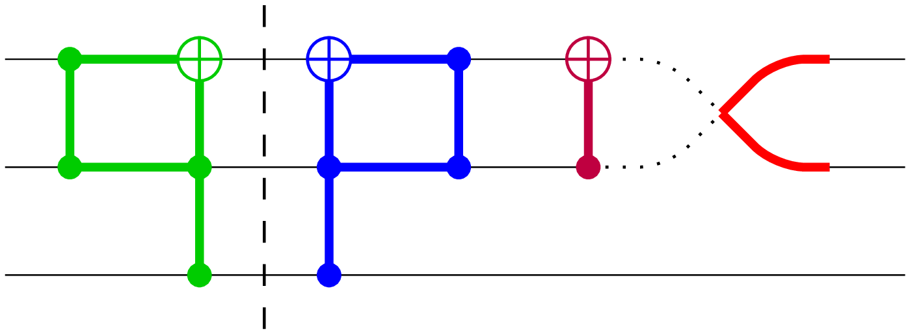
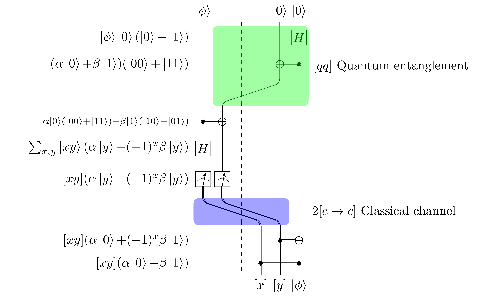

# ⟨q|pic⟩

## Quantum circuits made easy

[](#features)

### A compiler from quantum circuits to graphical representations.

<p align="center">
    <a href="https://img.shields.io/pypi/v/qpic.svg">
        
    </a>
    <a href="https://travis-ci.org/qpic/qpic">
        
    </a>
</p>

* Free software: GNU GPLv3 license
* Documentation: [⟨q|pic⟩ manual](doc/qpic_doc.pdf)

<!---
* Documentation: https://qpic.readthedocs.org.
    <a href="https://readthedocs.org/projects/qpic/?badge=latest">
        
    </a>

.. image:: https://img.shields.io/pypi/v/qpic.svg
        :target: https://pypi.python.org/pypi/qpic

.. image:: https://img.shields.io/travis/SmoothDragon/qpic.svg
        :target: https://travis-ci.org/SmoothDragon/qpic

.. image:: https://readthedocs.org/projects/qpic/badge/?version=latest
        :target: https://readthedocs.org/projects/qpic/?badge=latest
        :alt: Documentation Status
--->
# Contents
* [Features](#features)
* [Examples](#examples)
* [Using ⟨q|pic⟩](#using-qpic)

## Features

The ⟨q|pic⟩ language provides a concise, readable, ASCII format for describing quantum circuits. `qpic` converts ⟨q|pic⟩ files to the scientific paper standard of LaTeX using TikZ graphic commands.

* Automatic placement of circuit components.
* Human readable.
* Input ⟨q|pic⟩ syntax can be produced by other scripts.
* Can be included in LaTeX documents in TikZ or PDF form.

⟨q|pic⟩ produces high quality graphics quickly. The following graphic illustrating part of a ripple carry adder
[](#features)

is compiled from the ⟨q|pic⟩ code

```
a W a a\oplus{c}
b W b b\oplus{c}
c W c \mbox{MAJ}(a,b,c)

a b c G \rotatebox{90}{MAJ}
=
+b c
+a c
a b +c
```

## Examples

### Basic quantum teleportation circuit

[](#features)

This classic diagram derives from the following code:

```
a W |\psi\rangle
b c W |\beta_{00}\rangle<
c W |\psi\rangle
a +b
a H
a b M
c X b:owire
c Z a:owire
```

### Decorated quantum teleportation circuit

⟨q|pic⟩ has additional features for commenting or highlighting parts of a circuit. 

[](#features)

This diagram derives from the following:

```
PREAMBLE \providecommand{\K}[1]{\left|#1\right\rangle} # Define ket command
a  W \K{\phi} [x]
x1 W type=o # Empty wire used for positioning
x0 W style=dashed # Dividing line
x2 W type=o # Empty wire used for positioning
b0 W \K{0} [y]
b1 W \K{0} \K{\phi}

VERTICAL 0
b1 H    % $\K{\phi}\K{0}(\K{0}{+}\K{1})$
+b0 b1  % $(\alpha\K{0}{+}\beta\K{1})(\K{00}{+}\K{11})$
b0 x1 PERMUTE
+b0 a   %$\scriptstyle\alpha\K{0}(\K{00}{+}\K{11}){+}\beta\K{1}(\K{10}{+}\K{01})$
a H     % $\sum_{x,y}\K{xy}(\alpha\K{y}{+}(-1)^x\beta\K{\bar{y}})$
a b0 M  % $[xy](\alpha\K{y}{+}(-1)^x\beta\K{\bar{y}})$
x1 x2 a b0 PERMUTE
+b1 b0  % $[xy](\alpha\K{0}{+}(-1)^x\beta\K{1})$
b1 a    % $[xy](\alpha\K{0}{+}\beta\K{1})$

# Colored boxes
b0 b1 x1 x2 @ 0 2 fill=green style=rounded_corners %% $[qq]$ Quantum entanglement
a b0 x2 x1 @ 6 6 fill=blue style=rounded_corners %% \hspace{.5cm}$2[c\rightarrow c]$ Classical channel
```

For an explanation of `qpic` commands and more examples, see the [official documentation](doc/qpic_doc.pdf).

# Using ⟨q|pic⟩
* [Install](#install)
* [Uninstall](#uninstall)
* [Running ⟨q|pic⟩](#running-qpic) 
* [Using ⟨q|pic⟩ with LaTeX](#using-qpic-with-latex)

## Install

### Pip
Recommended installation method is [pip](https://en.wikipedia.org/wiki/Pip_(package_manager)).  Current versions of Python 2 and 3 include pip. For older versions, use [pip installation instructions](https://pip.pypa.io/en/stable/installing/).

`pip install qpic`

If you do not have permission to install or wish to install `qpic` as a single user, add `$HOME/.local/bin` to your `$PATH` and install using

`pip install --user qpic`

## Uninstall
To uninstall `qpic` simply type

`pip uninstall qpic`

### Stand alone script
To try out the basic script without installation:

1. Download the file `qpic.py`. (located in the `qpic` directory)
1. Run `python qpic.py your_file.qpic > your_file.tex`.

## Running ⟨q|pic⟩ 

`qpic` generates TikZ code by default. `qpic` can also generate pdf files
using `pdflatex` and png files using `convert` (from ImageMagic).

### Create TikZ file `diagram.tikz`

`qpic -f tikz diagram.qpic`

### Create PDF file `diagram.pdf`

`qpic -f pdf diagram.qpic`

### Create PNG file `diagram.png`

`qpic -f png diagram.qpic`


## Using ⟨q|pic⟩ with LaTeX 

### Including graphics in LaTeX documents

There are two main methods for including ⟨q|pic⟩ in LaTeX documents. Each has its advantage in certain areas. They are:

* [Include TikZ code directly](#tikz)
* [Include as a PDF graphic](#pdf)

### TikZ
`qpic my_graphic.qpic` produces a TikZ file named `my_graphic.tikz`, which can be directly included into a normal LaTeX document. You will need to add

```
\usepackage{tikz}
```

to the preamble of your paper. Graphics can then be included with the command:

```
\input{filename.tikz}
```

In some cases, additional TeX commands may be required in the preamble.  (These will be in the `.tikz` file preceded by `%!`.)  See the full ⟨q|pic⟩ documentation for when additional packages are required.

### PDF

`qpic -f pdf my_graphic.qpic` will produce a PDF file named `my_graphic.pdf`. This graphic can be viewed directly with a PDF viewer. To insert the graphic into a LaTeX document, add the following line to the preamble:

```
\usepackage{graphicx}
```

and include the file using the command:

```
\includegraphics{my_graphic.pdf}
```

This method requires the document to be processed with pdfLaTeX. For further information see the full ⟨q|pic⟩ documentation.

